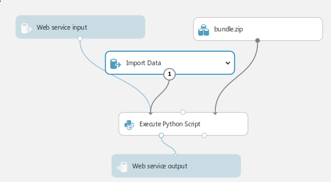

# Solution for Decoding Brain Signals, Cortana competition
The 4th place solution for the Cortana competition organized on the Microsoft Azure ML platform.

## How to run the prediction on Azure ML
After training the models, they will be saved in the *bundle* folder:
- Zip the *bundle* folder and upload it to Azure platform as a dataset.
- Create an experiment with the structure shown below.
- As an 'Execute Python Script' copy-paste one of the classifying scripts.

